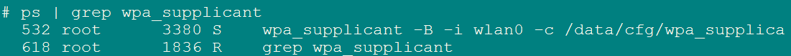
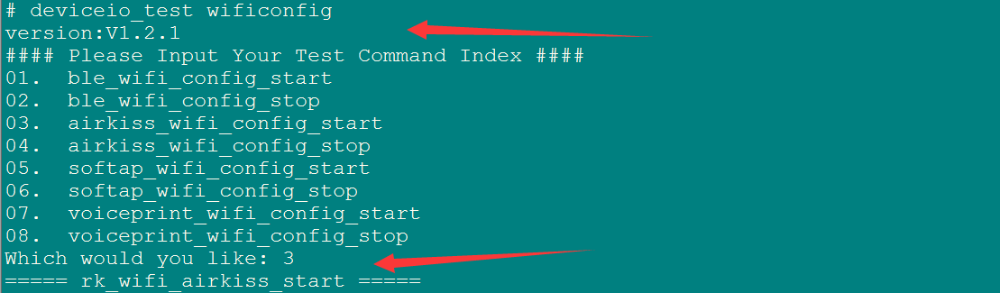

# Rockchip Linux Network Config Documentation #

---

发布版本：1.0

作者：CTF

日期：2019.5.13

文件密级：公开资料

---

**概述**

该文档旨在介绍Rockchip Linux各种配网方式。

**读者对象**

本文档（本指南）主要适用于以下工程师：

技术支持工程师

软件开发工程师

**对应DeviceIo库版本**

V1.2.1以上，不包含V1.2.1

**修订记录**

| **日期**  | **版本** | **作者** | **修改说明** |
| ---------| -------- | -------- | ---------- |
| 2019-4-29 | V1.0     | CTF | 初始版本     |
| 2019-5-13 | V1.0.1 | CTF | 修正手机配网各流程说明 |

---

[TOC]

---

## 1、WIFI/BT配置 

### 1.1 kernel配置 

- 请参考 /docs/Linux reference documents 目录下的 Rockchip Linux WIFI BT 开发指南 V6.0.pdf 文档，第一章节'WIFI/BT 配置' 


### 1.2 buildroot配置

- 根目录下执行`make menuconfig `

- rkwifibt配置，根据实际WiFi选择对应配置，必须跟kernel配置一致

  

  

- 蓝牙配置

  - realtek模组建议使用bluez 协议，正基/海华模组建议使用bsa 协议。

  - 以下配置，根据模组类型三选一

    - realtek模组选择：`bluez-utils 5.x `，使用bluez需要同时开启`bluez-alsa `  `readline `

      

      

      

      

      

      

    - 正基模组选择：  `broadcom(ampak) bsa server and app `

      进入 `wifi/bt chip support(XXX)--->  `  选择实际的芯片型号，必须跟rkwifibt配置一致

    - 海华模组选择 ： `broadcom(cypress) bsa server and app `

      进入 `wifi/bt chip support(XXX)--->  `  选择实际的芯片型号，必须跟rkwifibt配置一致

      

- 退出配置框，make savedefconfig保存配置

### 1.3 编译说明

- 根目录下执行：`make rkwifibt-dirclean && make rkwifibt-rebuild`

- 以下编译选项，根据模组类型三选一

  - realtek模组编译：`make bluez5_utils-rebuild`

    ​			        `make bluez-alsa-rebuild`

  - 正基模组编译： `make broadcom_bsa-rebuild`

  - 海华模组编译： `make cypress_bsa-rebuild`

- 根目录下执行：`make deviceio-dirclean && make deviceio-rebuild`

- 根目录下执行：`./build.sh`


## 2、命令行配网

- 首先确保WiFi的服务进程启动，串口输入：  `ps | grep wpa_supplicant`

  

- 如果没启动，请手动启动：

  `wpa_supplicant -B -i wlan0 -c /data/cfg/wpa_supplicant.conf & `

- 修改  ` /data/cfg/wpa_supplicant.conf `文件，添加配置项

  ```
  network={
  		ssid="WiFi-AP"		// WiFi名字
  		psk="12345678"		// WiFi密码
  		key_mgmt=WPA-PSK	// 选填加密方式，不填的话可以自动识别
  		# key_mgmt=NONE		// 不加密
  }
  ```

- 重新读取上述配置： `wpa_cli reconfigure`

- 重新连接： `wpa_cli reconnect`

## 3、手机配网

### 3.1 ble 配网

- 简介

  ble配网同时支持bluez ble配网和bsa ble配网，配置参照本文档的第一章节’WIFI/BT 配置‘。并且ble配网已集成到deviceio，接口位于RkBle.h。


- 接口说明

  请参考/docs/Develop reference documents/DeviceIo目录下Rockchip_Developer_Guide_Rk3308_DeviceIo_Bluetooth_CN.pdf文档，第二章节’BLE接口介绍（RkBle.h）‘。

- 示例程序

  示例程序的路径为：`external/deviceio/test/rk_ble_app.c`

- APP

  app路径：`/external/app/RockHome.apk `

  app源码路径：`/external/app/src/RockHome `

- 配网步骤

  - 该配网步骤以bsa ble配网为例进行说明，所有板端log均为bsa的配网log。bluez操作步骤相同，板端log不同。

  - 首先确保WiFi的服务进程启动，串口输入：  `ps | grep wpa_supplicant`

    

  - 如果没启动，请手动启动：

    `wpa_supplicant -B -i wlan0 -c /data/cfg/wpa_supplicant.conf & `

  - 板端命令行执行：`deviceio_test wificonfig `，输入1回车， 启动ble 配网

    

  - 设置的ble广播设备名必须以RockChip为前缀，否则apk无法检索到设备

    

  - 手机端打开apk

    点击CONTINUE -> START SCAN，扫描以RockChip为前缀命名的ble设备

        

  - 点击想要连接的ble设备，开始连接设备，设备连接成功，板端log如下

    

  - 设备连接成功，apk进入配网界面，点击 >>按钮 获取wifi list，选择想要连接的wifi，输入密码，点击Confirm开始配网

        

  - 板端接收到ssid和psk后，开始连接网络

    

  - 网络连接成功，板端发送通知给手机apk

    

  - apk端收到配网成功的通知后，断开ble连接，返回设备搜索界面，板端log如下

    

  - 再次启动配网，需要先输入2，关闭ble配网；再输入1重新启动ble，重复上述配网流程

### 3.2 airkiss 配网

- 简介

  目前airkiss配网只支持rtl8723ds，请参照本文档第一章节 ’WIFI/BT 配置‘进行相应配置；ap模组请参考external/wifiAutoSetup目录下的说明。

  airkiss兼容性很差，不建议客户使用，原因请参考 /docs/Develop reference documents/WIFIBT/RK平台_RTL8723DS_AIRKISS配网说明.pdf。目前airkiss配网已集成到deviceio中，接口位于Rk_wifi.h。

- kernel 修改

  修改 ` /drivers/net/wireless/rockchip_wlan/rtl8723ds/Makefile `   文件

  ```
  -CONFIG_WIFI_MONITOR = n
  +CONFIG_WIFI_MONITOR = y
  ```

- 接口说明

  - 启动airkiss配网，成功返回0，失败返回-1

    `int RK_wifi_airkiss_start(char *ssid, char *password)`

    ssid：手机端发送的wifi名称

    password：手机端发送的wifi密码

  - 关闭airkiss配网

    `void RK_wifi_airkiss_stop()`

- 示例程序

  示例程序的路径为：`external/deviceio/test/rk_wifi_test.c`

  该测试用例调用`RK_wifi_airkiss_start()`启动airkiss，获取ssid和password并启动wifi配网。

  主要接口：`void rk_wifi_airkiss_start(void *data)`，  在DeviceIOTest.cpp中调用。

  

- 微信配网方式

  可以使用手机app 或者 扫描微信二维码的方式配置网络

  - 手机app

    下载地址：https://iot.weixin.qq.com/wiki/document-download.html ，进入下载中心 -> WiFi设备 -> airkiss 调试工具，下载AirKissDebugger.apk

    

  - 二维码

    微信扫描如下二维码，二维码配网时，手机必须先连接wifi，否则会提示：未能搜索设备，请开启手机wifi后重试

    

  

- 配网步骤

  - 首先确保WiFi的服务进程启动，串口输入：  `ps | grep wpa_supplicant`

    

  - 如果没启动，请手动启动：

    `wpa_supplicant -B -i wlan0 -c /data/cfg/wpa_supplicant.conf & `

  - 手机端操作以app为例进行说明，打开AirKissDebugger.apk，输入ssid和password，AESKey为空、不输入。点击发送按钮，配网成功会弹窗提示“AirKissDebugger：Bingo”

      

  - 板端命令行执行：`deviceio_test wificonfig `，输入3回车，启动airkiss 配网

    

  - airkiss 启动成功

    

  - 成功接收ssid和password，并开始配网

    

  - 配网成功

    

  - 再次启动配网，需要先输入4，关闭airkiss配网；再输入3重新启动airkiss，重复上述配网流程

### 3.3 Softap 配网

- 简介

   ​	首先，用SDK板的WiFi创建一个AP热点，在手机端连接该AP热点；其次，通过手机端apk获取SDK板的当前扫描到的热点列表，在手机端填入要连接AP的密码，apk会把AP的ssid和密码发到SDK板端；最后，SDK板端会根据收到的信息连接WiFi。

   ​	Softap配网已集成到deviceio中，接口位于Rk_softap.h。

- APP

   app路径：`/external/app/RockHome.apk `

   app源码路径： `/external/app/src/RockHome `

- buildroot配置

  

  

- 接口说明

  - 启动softap配网：

    `RK_softap_start(char* name, RK_SOFTAP_SERVER_TYPE server_type)`

    name：wifi热点的名字，前缀必须为Rockchip-SoftAp

    server_type：网络协议类型，目前只支持TCP协议

  - 结束softap配网

    `int RK_softap_stop(void)`

  - 注册状态回调

    `RK_softap_register_callback(RK_SOFTAP_STATE_CALLBACK cb)`

    正在连接网络：`RK_SOFTAP_STATE_CONNECTTING`

    网络连接成功：`RK_SOFTAP_STATE_SUCCESS`

    网络连接失败：`RK_SOFTAP_STATE_FAIL`

- 示例程序

   示例程序的路径为：`external/deviceio/test/rk_wifi_test.c`

   主要接口：`void rk_wifi_softap_start(void *data)`， `rk_wifi_softap_stop(void *data)`，在DeviceIOTest.cpp中调用。

- 配网步骤

  - 首先确保WiFi的服务进程启动，串口输入：  `ps | grep wpa_supplicant`

    

  - 如果没启动，请手动启动：

    `wpa_supplicant -B -i wlan0 -c /data/cfg/wpa_supplicant.conf & `

  - 板端命令行执行`deviceio_test wificonfig`，输入5 回车，启动softap配网

    

  - 打开RockHome.apk，左侧滑选择第三个选项，进入softap配网方式，点击 SEARCH DEVICES，扫描以Rockchip-SoftAp为前缀命名的softap设备

        

  - 点击想要连接的softap设备，开始连接设备，设备连接成功，板端log如下

    

  - 设备连接成功，apk进入配网界面，点击 >> 获取wifi list，选择想要连接的wifi，输入密码，点击Confirm开始配网

        

  - 板子收到ssid和psk，开始连接网络

    

  - 网络连接成功

    

  - 配网成功后，板端disableWifiAp，手机apk返回设备搜索界面，板端log如下

    

  - 想要再次启动softap配网，需要先输入6，回车反初始化softap，再输入5重新初始化softap，重复上述配网步骤
